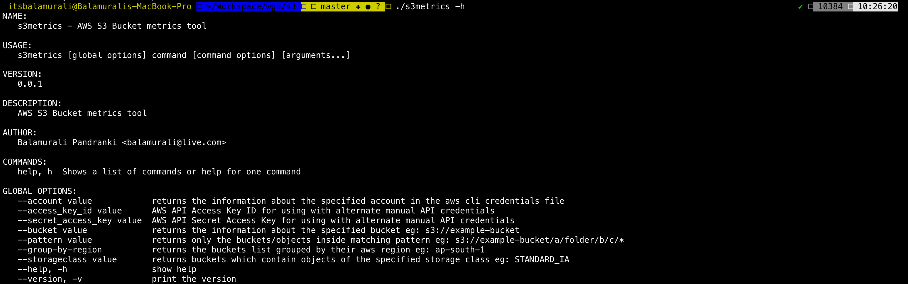

# S3Metrics - WGU Devops Challenge

## About

AWS S3 storage analysis tool




The s3metrics is a shell command line utility that returns information over all S3 buckets in an Amazon Web Services account.

s3metrics works on Linux, OSX and Windows.

It's easy to install and use.

s3metrics doesn't require installation of any other tools / libraries / frameworks to work. And can be easily cross compiled for other systems or architectures.

## What could be improved (Time constraints :P)

- Write Unit Test's.
- Little more code documentation / comments.
- Find the Actual cost of the object based on created / last modified date.
- Implement All the filters & search patterns(couple of if conditions).
- Error handling
- More go routines while heading objects.

## Development Dependencies / Requirements

[Golang v1.13](https://golang.org)

## Required IAM Policies

After creating or while configuring your `aws` cli IAM credentials please assign the below policies for this tool to work.

- AmazonS3ReadOnlyAccess - IAM Permission Policy
- AWSPriceListServiceFullAccess - IAM Permission Policy

## How to compile

```bash
$ git clone https://github.com/itsbalamurali/wgu-s3
$ cd wgu-s3
$ go build -o s3metrics
```

## [How to cross-compile for different operating systems / architectures](https://www.digitalocean.com/community/tutorials/how-to-build-go-executables-for-multiple-platforms-on-ubuntu-16-04)

## How to run

For the time being the tool loads the IAM config/credentials that are used/setup during `aws` cli setup

```bash
$ ./s3metrics #Thats it
$ ./s3metrics help #Access help & options
```
